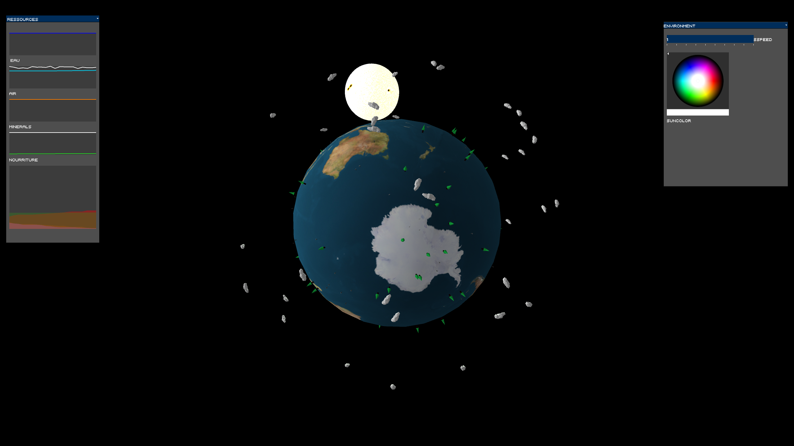
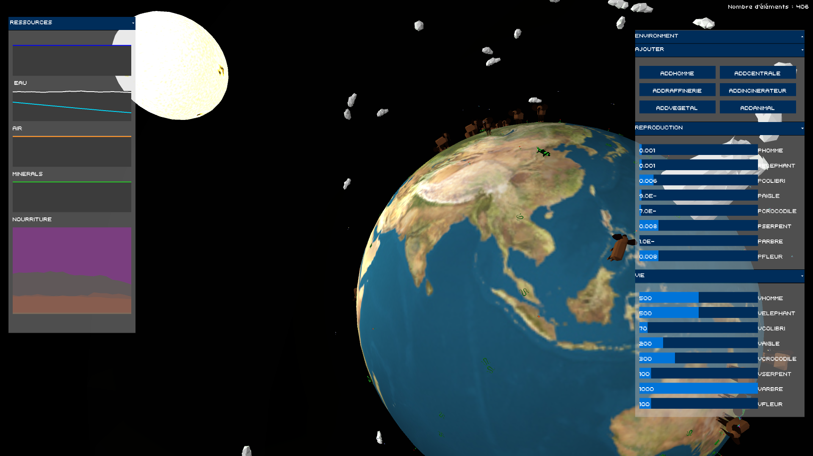
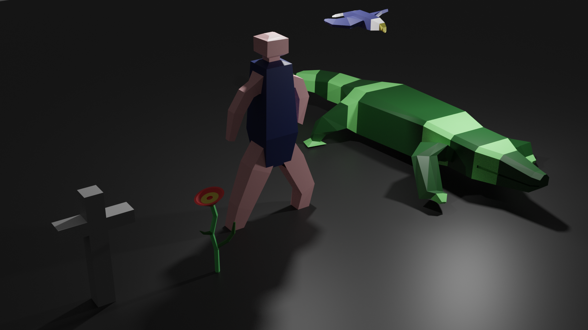
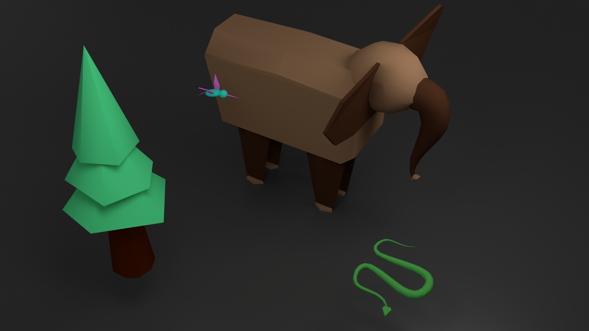

# Simplified World Simulation

## Projet de Java 2I002 mars 2019
This project is a simplified world simulation using the Processing library with OpenGL for 3d and controlP5 for the UI.
It was made at Sorbonne Université in Java computer science class by Isabelle Bernard and Joseph Henry.

## How to use it
You can either open the project with Eclipse and launch it (the main file is `Simulation.java`) or type :

```
java -jar simulation.jar
```

<span style="color:red;">Note</span> : you must use a <strong>version of openjdk <= 10 due to an error with the jogl library</strong> : (http://forum.jogamp.org/Inconsistency-detected-by-ld-so-dl-lookup-c-td4040188.html)

If you are on Linux and you have a different java version installed on your system, just run :

```
sudo update-alternatives --config java
```

And choose `java-x-openjdk` where x <= 10

---

Once the simulation launched, click on the toolbar and have fun !


### More information
You can check the UML diagram here : [UML diagram](argouml/uml.pdf)
And also check the document explaining the project (using LaTeX in French) : [reference document](latex/compte_rendu_2I002.pdf)

### Screenshots





### Libraries and softwares
* [Processing](https://github.com/processing/processing)
* [PeasyCam for handling 3d camera](https://github.com/jdf/peasycam)
* [ControlP5 UI library](https://github.com/sojamo/controlp5)
* [ArgoUML](http://argouml.tigris.org/)
* [TexMaker, LaTeX editor](https://www.xm1math.net/texmaker/)
* [Blender to create 3d models](https://www.blender.org)
